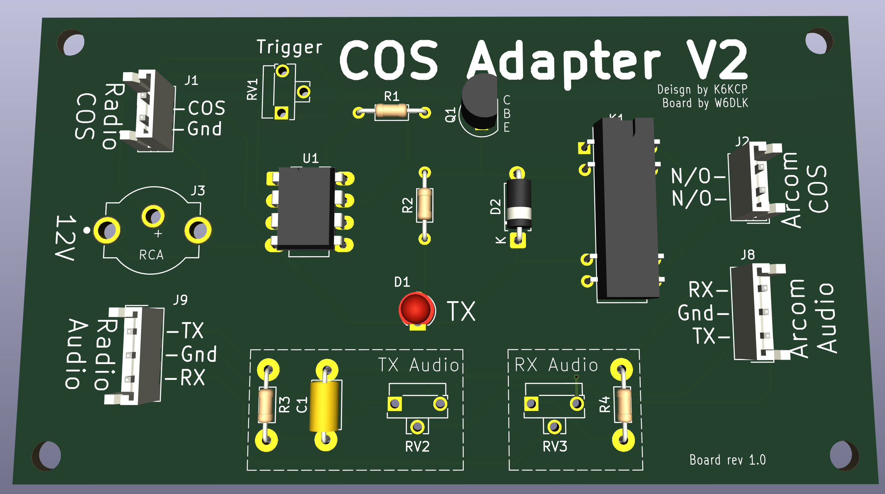
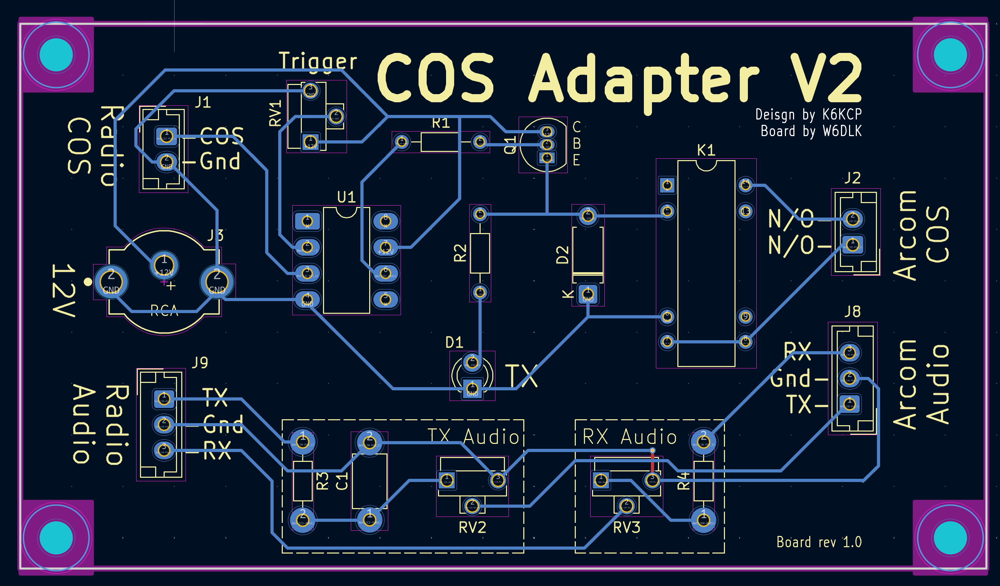
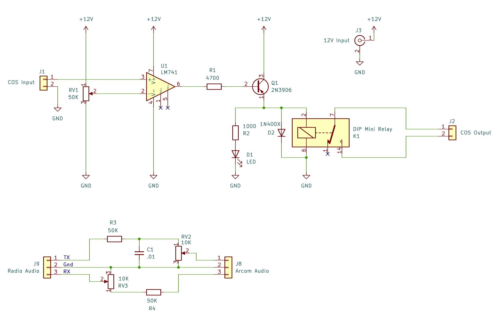

# COS Adapter V2

The [Kenwood TK-981](https://www.kw902.com/981generalinfo.html) radio's COS output
does not go suffciently low to reliably trigger the
[Arcom RC210](https://www.arcomcontrollers.com/index.php?Itemid=524&route=product/product&product_id=33)
controller's COS input, so Jim (K6KCP) designed this comparator circuit to perform
the trick.

## Features

* Trigger pot to adjust the COS trigger level
* Relay to close COS outut (normally open)
* Audio circuitry (thanks Steve W6KCS) to adjust and filter the audio between
  the devices.  Components can be added or jumpered to suit.
* Mounting holes for a small [project box](https://amazon.com/dp/B07D23C962/)
  or inside the [RC210 enclosure](https://www.arcomcontrollers.com/index.php?Itemid=524&route=product/product&product_id=32)

## Parts list

| **C1** |  .01 |
| **D1** |  LED |
| **D2** |  1N400X |
| **J1** |  2-pin JMT male |
| **J2** |  2-pin JMT male |
| **J3** |  RCA phono (or wires to Anderson PowerpPole) |
| **J8** |  3-pin JMT male |
| **J9** |  3-pin JMT male |
| **K1** |  DIP Mini Relay |
| **Q1** |  2N3906 |
| **R1** |  4700 ohm |
| **R2** |  1000 ohm |
| **R3** |  50K optional |
| **R4** |  50K optional |
| **RV1** | 50K trim pot |
| **RV2** | 10K trim pot |
| **RV3** | 10K trim pot |
| **U1** |  LM741 |

## 3-D rendering

## PCB Layout

## Schematic

